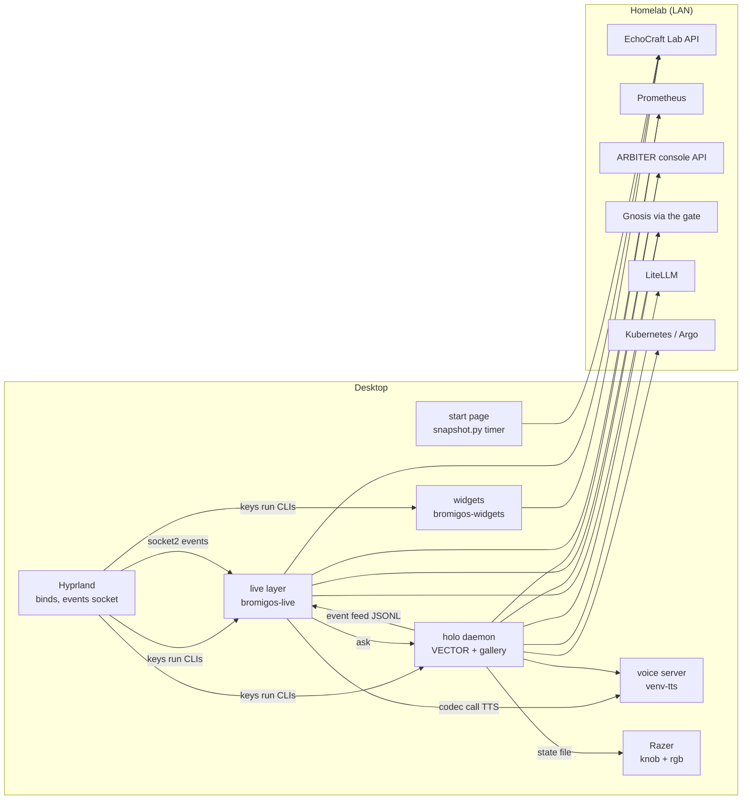

# The Bromigos desktop

The operator's Hyprland workstation, themed as **the Wick**: BLACKFLAME's relay station
in the Bromigos universe. Phosphor green on void, a retro sci-fi HUD in which every
light and number is a real reading. It exists so the operator can run his homelab, his
repos and the ARBITER paper portfolio from his desktop at a glance, and so VECTOR (the
desktop AI) has a body and a stage.

**Status:** active, on one Arch Linux + Hyprland machine. Everything here is stowed
from `~/.dotfiles` (`stow linux`). The repo is public: secrets live in mode-600 files
under `~/.local/share/bromigos/` and in Vault, never in git.

The network-wide systems map (every Bromigos service and repo) lives in the private
`bromigos-org/platform` repo at `docs/SYSTEMS.md`.

## The pieces

| Piece | Where (in `~/.config`, from `linux/.config`) | What it is | Docs |
|-------|-------|------------|------|
| Brand kit | `bromigos/brand/`, `bromigos/identity.json`, `bromigos/lib/bromigos_emblem.py`, `bromigos/bin/bromigos-emblem` | Palette, the burn-in emblem (one SVG source), logos, portraits, icons, wallpapers, 3D models | `brand/README.md`, `brand/3d/README.md` |
| Theme | `hypr/`, `waybar/`, `rofi/`, `dunst/`, `bromigos/gtk/`, `~/.local/share/{themes,icons,color-schemes}` | Hyprland look, bar, launcher, notifications, GTK/Qt themes, cursor, lock and idle | this file, "Theme" |
| Widgets | package `bromigos-widgets` (bromigOS `widgets/`); here `bromigos/widgets/` (layout.json, launcher), `bromigos/plugins/widgets/` | Seven GTK layer-shell panels on the BOTTOM layer: SYSTEM, NETWORK, STORAGE, LAB, WORKBENCH, FIELD NOTES, SHORTCUTS, plus plugin panels (GAME SERVERS) | `widgets/README.md`, bromigOS `widgets/README.md`, `docs/plugins.md` |
| Live layer | package `bromigos-live` (bromigOS `live/`); here `bromigos-live/` (config.toml, launcher), `bromigos/plugins/live/` (the ARBITER deck, replay, Netmap, Ops, Mind) | The animated background behind every window, the summoned decks and holograms, event animations, codec calls, the screensaver, sounds | `../bromigos-live/README.md`; bromigOS `live/README.md`, `live/docs/ELEMENTS.md`, `docs/plugins.md` |
| VECTOR and the holo daemon | `bromigos/holo/` | VECTOR (chat, voice, memory, tools, his terminal), the shared 3D hologram renderer and the model gallery | `holo/README.md` |
| Skills | `bromigos/skills/` | Markdown know-how VECTOR loads on demand (how the desktop is built, its data sources, homelab ops) | each file's frontmatter |
| Start page | `bromigos/startpage/` | The browsers' home and new-tab page | this file, "Start page" |
| Login screen | `bromigos/sddm/` | The SDDM theme at boot: the lock screen's den, burn-in and clock plus account, session and power; no live data; installed by `sddm/install.sh` with sudo | `sddm/bromigos/README.md` |
| Razer integration | `hypr/razer-blackwidow.xkb`, `bromigos/bin/bromigos-knob`, `bromigos/bin/bromigos-rgb` | Macro keys and the dial bound to the desktop; lighting follows VECTOR | this file, "Razer" |
| Shell | `bromigos/shell/`, `zsh/.config/zsh/zsh-bromigos` | Prompt colours and the `bromigos` banner | `zsh/.config/zsh/AGENTS.md` |
| Capture | `bromigos-shot`, `bromigos-rec` (bromigOS, package bromigos-desktop) | Screenshots and recordings with a themed notification and a quiet cue | the scripts' headers |
| Wallpaper switcher | `bromigos/bin/bromigos-wallpaper` | Chooses the den variant (den, empty, masked, v1) for the desktop and the lock screen | the script's header |
| Services | `systemd/user/bromigos-*.{service,timer}` | Start page snapshot (every minute), knowledge-base sync (nightly), the dial, the lighting | this file, "Services" |

## How the pieces talk

- **Keys** (Hyprland) run each component's CLI: `bromigos-widgets toggle …`,
  `bromigos-live <deck>`, `bromigos-holo vector`. The CLIs talk to their daemons over
  unix sockets in `$XDG_RUNTIME_DIR`: `bromigos-widgets.sock` (datagram),
  `bromigos-live.sock`, `bromigos-holo.sock`, and VECTOR's voice server on
  `bromigos-holo-voice.sock`.
- **Hyprland's event socket** (`.socket2.sock`) tells the live layer about workspaces,
  windows, fullscreen and monitor hotplug (it pauses, wipes and self-heals on these).
- **VECTOR → holograms:** VECTOR appends what he does (recalls, tool calls, tasks,
  pushes, CI, Argo syncs, cluster actions) to `$XDG_RUNTIME_DIR/bromigos-vector-events.jsonl`;
  the live layer's holograms draw it. Schema: `holo/README.md`, "Event feed".
- **VECTOR drives the holograms** with `bromigos-live <deck> <verb>` (from his tools or
  shell); the live layer hands work back to him with `bromigos-holo ask "…"`.
- **VECTOR's state** (`$XDG_RUNTIME_DIR/bromigos-vector.json`: shown, mood, voice,
  unread) is read by the waybar pip and the Razer lighting.
- **Speech:** codec calls in the live layer ask VECTOR's voice server for the line (one
  voice on the desktop); the homelab's Breeze TTS answers only if that server is down.
- **Sounds:** short cues in `/usr/lib/bromigos/live/sounds/` (package `bromigos-live`), played through PipeWire at low
  volume; one mute (SUPER+SHIFT+M) is honoured by the live layer, the capture scripts
  and codec calls. VECTOR has his own mute (SUPER+SHIFT+V).
- **Homelab data:** the Lab API (bearer token from `lab-token`), Prometheus, ARBITER's
  console (GET only), Gnosis through the gnosis-gate with narrow tokens, LiteLLM. The
  full list, with costs and safe poll rates, is `skills/data-sources.md`.

## Where state lives (and what is not in git)

| What | Where | Made by | If lost |
|------|-------|---------|---------|
| Private values (internal URLs, LAN hosts, Vault paths, netmap) | `../private.sops.yaml` (encrypted, in git) → `~/.config/bromigos/private/` (`config.json`, `env`, `NOTES.md`) | `bromigos-private decrypt` (at login) | `bromigos-private decrypt`; the age key at `~/.config/sops/age/keys.txt` is backed up in Vault (see the private notes) |
| Keys and tokens | `~/.local/share/bromigos/*-token`, `*-key`, `*-kubeconfig`, `vault-vector-*` | `bromigos-secrets sync`, from Vault (paths in the private overlay's `secrets:` manifest) | `bromigos-secrets sync`; see AGENTS.md, "Private values" |
| Python environments | `~/.local/share/bromigos/venv` (3D model baking), `venv-brain` (VECTOR's Pydantic AI brain, with system site packages), `venv-tts` (speech: Python 3.12, torch) | by hand | `venv`: the `uv` command in `brand/3d/README.md`; `venv-brain` and `venv-tts`: their packages are listed in `holo/README.md` (no one-line recreate script yet) |
| Voice models | `~/.local/share/bromigos/voice/` (Kokoro, Silero VAD), `voices/` (VECTOR's voice references) | `holo/voices/make-refs.py` | re-render (`holo/voices/README.md`) |
| FIELD NOTES | `~/.local/share/bromigos/notes.md` | the operator | not recoverable: back it up |
| Wallpaper choice | `~/.local/state/bromigos/wallpaper/{den,lock}.jpg`, `variant` | `bromigos-wallpaper` | `bromigos-wallpaper den` |
| VECTOR's logs and history | `~/.local/state/bromigos/` (`vector-chat.log`, `vector-audit.log`, `vector-shell.log`, `vector-sessions.json`, `holo.log`) | the holo daemon | history is gone; logs restart |
| VECTOR's memory | Gnosis (space `vector`); a local mirror in `~/.cache/bromigos/vector-memory.json` | VECTOR | the mirror rebuilds from Gnosis |
| Knowledge base sync state | `~/.local/state/bromigos/kb-sync.json` | `holo/tools/kb-sync.py` | a full re-sync (about 7 min) |
| Live layer history | `~/.local/state/bromigos-live/history.npz`, `events.jsonl` (72 h), `swarm-seen.json`, `live.log` | the live layer | history restarts empty |
| Caches | `~/.cache/bromigos/` (TTS lines, emblem text), `~/.cache/bromigos-live/` (clean plate, kb chart, CI, Drift map layout) | on demand | rebuilt automatically |
| Start page data | `bromigos/startpage/data.js` (gitignored) | `bromigos-startpage.timer` | next minute |
| Runtime | `$XDG_RUNTIME_DIR/bromigos-*` (sockets, pid, the event feed, VECTOR's state) | the daemons | recreated on start |
| KDE colour config | `~/.config/kdeglobals` (untracked) | `plasma-apply-colorscheme Bromigos` | rerun it |

Generated assets that are in git are rebuilt with: `bromigos-emblem build` (emblem
PNGs), `gtk/build-gtk-theme.py` and `gtk/build-icons-cursor.py` (themes, cursor),
`brand/icons/build-icons.py`, `brand/3d/tools/bake.py` (models),
bromigOS `live/tools/make-starship.py` (the swarm's ship), `shell/build-emblem-braille.py`.

## Theme

- **Hyprland:** a Lua config (Hyprland 0.56; the old `.conf` format goes away in 0.57).
  bromigOS ships the desktop's defaults (package `bromigos-desktop`,
  `/usr/share/bromigos/default/hypr/`: look, input, layer and generic window rules,
  autostart, every bromigOS bind, the bind helpers `bromigos/keys.lua`); `hypr/hyprland.lua`
  here sets the `bromigos` table (monitors, workspace→monitor, input options, the default
  binds it replaces), runs the defaults, then adds what's mine: my apps' rules and binds, my
  decks' binds (personal plugins) and the LAB panel's. The Razer (keymap, macro keys, the
  mic-mute fix) is `hypr/bromigos/razer.lua`. How to add a bind or rule, and the Lua form of
  `hyprctl dispatch`: [`skills/hyprland-config.md`](skills/hyprland-config.md).
  `hypr/hyprland.conf` is kept only as the rollback (see Operations).
- **Bar, launcher, notifications, idle:** bromigOS's defaults too (`/usr/share/bromigos/default/`):
  `waybar/config` includes them and sets my outputs and the CPU sensor, `waybar/style.css`
  imports the theme then the default style, `rofi/config.rasi` imports the default,
  `dunst/dunstrc` links to the default (drop-ins in `dunstrc.d/`), `hypr/hypridle.conf`
  sources the default. The lock screen's files (`gtklock/`, `hypr/hyprlock.conf`) are still
  full copies here.
- **Bar** (`waybar/`): HUD modules with icons from the brand kit, GPU and storage scripts,
  VECTOR's pip (`custom/vector`).
- **Launcher** (`rofi/`): `bromigos.rasi`, a power menu, quick note, and the searchable
  shortcut list (SUPER+SHIFT+K).
- **Notifications** (`dunst/`): themed; `capture.*` rules for screenshots and recordings.
- **Lock and idle** (`hypr/hyprlock.conf`, `hypridle.conf`): screensaver at 8 min, lock at
  10, displays off at 15, never suspends.
- **GTK, icons, cursor** (`bromigos/gtk/`): built into `~/.local/share/themes/Bromigos`,
  `icons/Bromigos`, `icons/Bromigos-cursor`; applied with gsettings.
- **Qt/KDE apps** (OBS, file dialogs): `~/.local/share/color-schemes/Bromigos.colors`,
  applied with `plasma-apply-colorscheme Bromigos`; Qt reads it through
  `QT_QPA_PLATFORMTHEME=kde`.
- **Colours** come from bromigOS's active theme (`wick` by default; `bromigos theme
  list|current|set`), rendered into `~/.local/state/bromigos/theme/current/`: waybar's and
  gtklock's `style.css` and rofi's `bromigos.rasi` import it, kitty includes it
  (`kitty/bromigos-linux.conf`), `hyprland.lua` loads it with `dofile`, and
  `dunst/dunstrc.d/90-bromigos-theme.conf` and `Bromigos.colors` are symlinks to it.
  bromigOS's docs/theming.md has the format.
- **File manager:** PCManFM (ALT+E), by operator choice. The WORKBENCH panel's rows
  still open Dolphin (see "Known issues").

## Start page

`bromigos/startpage/index.html`: search, the switchboard of homelab links with up/down,
Lab status, the latest FIELD NOTES and a clock. A page can't read local files or send
the Lab token, so `snapshot.py` writes `data.js` every minute from
`bromigos-startpage.timer`; the token never reaches the page.

- **LibreWolf:** `librewolf-user.js` is linked as the profile's `user.js`, so Home and
  new windows open the page. For new tabs: load `startpage/manifest.json` as a temporary
  add-on (`about:debugging`), or use any new-tab-override add-on pointed at the page.
- **Chrome:** `chrome://extensions` → Developer mode → Load unpacked →
  `~/.config/bromigos/startpage`. Home and startup pages: point them at the file URL.

## Razer

openrazer (the operator is in the `openrazer` group) puts the BlackWidow V4 Pro in
driver mode, so M1–M5 send F13–F17, the side buttons F18–F20 and the dial press F24.
`hypr/razer-blackwidow.xkb` keeps those as plain F-keys; the binds (`hypr/bromigos/razer.lua`)
use their keycodes and listen to the Razer only (its devices carry the `razer-blackwidow` tag):

| Key | Action |
|-----|--------|
| M1 | show or hide VECTOR (`bromigos-holo vector`) |
| M2 (hold) | push to talk |
| M3 | open VECTOR and toggle conversation mode (`bin/vector-converse`) |
| M4 | holo deck |
| M5 | screenshot a region (`bromigos-shot region`) |
| Side 3 | start or stop recording a region (`bromigos-rec region`); Shift + M-keys don't combine (Shift and the M-keys are different Razer devices) |
`bromigos-knob` (service `bromigos-knob`) grabs the dial and steps VECTOR's voice;
`bromigos-rgb` (service `bromigos-rgb`) lights the keyboard and the Naga in VECTOR's
voice colour, amber when he is concerned, red breathing when alarmed, green at rest.

## Services

| Unit | Runs | Check |
|------|------|-------|
| `bromigos-startpage.timer` → `.service` | `startpage/snapshot.py`, every minute | `systemctl --user list-timers` |
| `bromigos-kb-sync.timer` → `.service` | `holo/tools/kb-sync.py`, nightly 03:30 | `~/.local/state/bromigos/kb-sync.log` |
| `bromigos-knob.service` | `bin/bromigos-knob` | `systemctl --user status bromigos-knob` |
| `bromigos-rgb.service` | `bin/bromigos-rgb` | `systemctl --user status bromigos-rgb` |

The daemons themselves start from Hyprland's login autostart (`hl.on("hyprland.start", …)`
in bromigOS's default `hyprland.lua` and `bromigos/live.lua`: `waybar`, `dunst`,
`bromigos wallpaper apply`, `bromigos-widgets`, `bromigos-live start --login`,
`hypridle`; hyprload from `bromigos.autostart` here); the holo daemon starts on first use of its key.

## Operations

- **Deploy:** edit in `~/.dotfiles`, `stow linux` for new directories, then restart the
  piece: `bromigos-live restart`, `bromigos-holo restart`,
  `pkill -f bromigos-widgets$ && hyprctl dispatch 'hl.dsp.exec_cmd("~/.config/bromigos/widgets/bromigos-widgets")'`;
  Hyprland reloads by itself when a `hypr/*.lua` file is saved (`hyprctl configerrors` shows
  mistakes; `Hyprland --verify-config -c ~/.config/hypr/hyprland.lua` checks first). There
  is no CI for the desktop; test headless first (`/usr/lib/bromigos/live/tools/offscreen.py`,
  `holo/tools/offscreen.py`).
- **Health:** `bromigos-live status` (mode, target and measured fps, surface mapped or
  missing, every bromigos layer on the monitor), `bromigos-holo status`,
  `hyprctl layers`.
- **Common failures:**
  - *Animations stopped after the monitor was off:* surfaces die with the output; all
    three daemons now remap themselves within seconds (and every 30 s). If not:
    `bromigos-live status`, then restart that piece.
  - *No notifications at all:* dunst can die on a hotplug; the live layer relaunches it,
    or run `hyprctl dispatch 'hl.dsp.exec_cmd("dunst")'`.
  - *LAB panel says no token:* `~/.local/share/bromigos/lab-token` is missing.
- **Roll back:** `git revert` the commit in `~/.dotfiles` and restart the piece.
- **Hyprland config format:** `bin/bromigos-hyprconfig status` says which format runs and
  which file loads at login. `bromigos-hyprconfig conf` rolls back to `hypr/hyprland.conf`
  (unlinks `hyprland.lua`; log out and back in, since a running 0.56 Hyprland crashes if
  switched back live; until then an error bar says it can't open `hyprland.lua`);
  `bromigos-hyprconfig lua` links the Lua config back, checks it and switches the running
  Hyprland. Scripts that dispatch use `bin/bromigos-dispatch '<Lua>' <old form>` so they
  work on either.

## Adding a new piece

1. Put it in the right stow tree (`linux/.config/<name>/`), with a header docstring or a
   README that says what it is, why it exists, how to run it and where its state lives.
2. Follow `skills/desktop-style-guide.md` (real data only, palette tokens, hover hints,
   nothing over windows) and, for anything animated or 3D, `skills/hologram-build.md`.
3. Keys: a `K.exec(…)` / `K.dsp(…)` line in `hypr/hyprland.lua` (mine), or in bromigOS's
   `desktop/hypr/bromigos/binds.lua` / `live.lua` for a bind every bromigOS desktop gets
   (check `hyprctl binds -j` for free keys; see `skills/hyprland-config.md`), an `EXEC` row in bromigOS `widgets/keybinds.py` for SHORTCUTS,
   then `bromigos-docs keys` to regenerate the table in `AGENTS.md`.
4. Secrets: a mode-600 file in `~/.local/share/bromigos/`, sourced from Vault; add its
   path (never its value) to the state table above.
5. Add a row to "The pieces" here and to the map in `AGENTS.md`; commit
   (`Added:`/`Updated:`) and push.

## Known issues

- The start page's switchboard is empty: `snapshot.py` still looks for the widgets'
  `SwitchboardPanel`, which became `WorkbenchPanel` (and no longer holds the link list).
- The WORKBENCH panel opens folders in Dolphin, while the operator's file manager is
  PCManFM.
